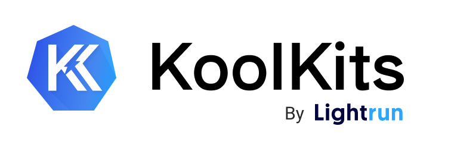

# 🧰 KoolKits 🧰

Opinionated, language-specific, batteries-included debug container images for Kubernetes.

Available for:

[](https://github.com/lightrun-platform/koolkits/tree/main/nodejs) [](https://github.com/lightrun-platform/koolkits/tree/main/python) [](https://github.com/lightrun-platform/koolkits/tree/main/jvm) [](https://github.com/lightrun-platform/koolkits/tree/main/golang)

KoolKits (**K**ubernetes t**oolkits**) are language-specific container images that contain a (highly-opinionated) set of tools for debugging applications running in Kubernetes pods. You can read more about the motivation behind this project [here](#-motivation-).

Prefer video to reading? We have you covered:

[](https://www.youtube.com/watch?v=xRsdA4EGUlE)

Those images are intended for use with the new `kubectl debug` feature, which spins up [Ephemeral containers](https://kubernetes.io/docs/concepts/workloads/pods/ephemeral-containers/) for interactive troubleshooting. A KoolKit will be pulled by `kubectl debug`, spun up as a container in your pod, and have the ability to access the same process namespace as your original container. 

Since production containers are usually **[rather bare](https://cloud.google.com/architecture/best-practices-for-building-containers#remove_unnecessary_tools)**, using a KoolKit enables you to **troubleshoot with power tools** instead of relying on what was left behind due to the generosity (or carelessness) of whoever originally built the production image.

## 🏁 Quickstart 🏁

Run a Node.js KoolKit in your production cluster (Kubernetes v1.23 and above):

```shell
kubectl debug -it <POD-NAME> --image=lightruncom/koolkits:node --image-pull-policy=Never --target=<DEPLOYMENT-NAME>
```

Run a JVM KoolKit in MiniKube (Kubernetes v1.23 and above): 

```shell
minikube kubectl -- debug -it <POD-NAME> --image=lightruncom/koolkits:jvm --image-pull-policy=Never --target=<DEPLOYMENT-NAME>
```

#### Adding to `.bashrc`/`.zshrc`

You can use KoolKits faster by adding the following function to your `.bashrc`:

```bash
echo "## KoolKits - Shorthand
kk() {
	kubectl debug -it $1 --image=lightruncom/koolkits:$2 --image-pull-policy=Never --target=$3
}" >> ~/.bashrc
source ~/.bashrc
```

Or into your `.zshrc`:
```zsh
echo "## KoolKits - Shorthand
kk() { 
	kubectl debug -it $1 --image=lightruncom/koolkits:$2 --image-pull-policy=Never --target=$3
}" >> ~/.zshrc
source ~/.zshrc
```

Then run `kk`:

```bash
kk demo-123123-qweqwe2 jvm demo
```

Where the full syntax is:

```shell
kk <POD-NAME> <LANGUAGE> <DEPLOYMENT-NAME>
```
 
## 👇 Available KoolKits 👇

Each of the folders in this repo contains the Dockerfile - and a short explanation of - the debug image. All KoolKits are based on the [`ubuntu:20.04`](https://hub.docker.com/layers/ubuntu/library/ubuntu/20.04/images/sha256-57df66b9fc9ce2947e434b4aa02dbe16f6685e20db0c170917d4a1962a5fe6a9?context=explore) base image, since real people need real shells. 

The list:

1. [`koolkit-jvm`](jvm/README.md) - AdoptOpenJDK 17.0.2 & related tooling (including `jabba` for easy version management and Maven 3.8.4)
1. [`koolkit-node`](nodejs/README.md) - Node 16.13.1 & related tooling (including `nvm` for easy version management)
1. [`koolkit-python`](python/README.md) - Python 3.10.2 & related tooling (including `pyenv` for easy version management)
1. [`koolkit-golang`](golang/README.md) - Go 1.17.6 & related tooling (including `gvm` for easy version management)

Note that you don't actually have to build them yourselves - all KoolKits are hosted publicly on [Docker Hub](https://hub.docker.com/repository/docker/lightruncom/koolkits) and available free of charge. 

**Got a suggestion for improvements?** We'd be happy to hear all about it - just open an issue with the requested tooling.

## 🚧 Coming up / WIP 🚧

- [x] A whole new, Go 1.17.7 KoolKit _(released on March 2022)_
- [ ] JVM KoolKit - [`jvm-profiler`](https://github.com/uber-common/jvm-profiler), [`jHiccup`](https://github.com/giltene/jHiccup) support
- [ ] Node.js KoolKit - [`llnode`](https://github.com/nodejs/llnode), [`thetool`](https://github.com/sfninja/thetool) support
- [ ] Python KoolKit - [`vardbg`](https://github.com/CCExtractor/vardbg), [`memprof`](https://github.com/jmdana/memprof) support
## 🏃 Motivation 🏃

There's a [well-known Kubernetes best practice](https://cloud.google.com/blog/products/containers-kubernetes/kubernetes-best-practices-how-and-why-to-build-small-container-images) that states that one should build **small** container images. This makes sense for a few different reasons:

1. Building the image will consume less resources (aka CI hours)
2. Pulling the image will take less time (who wants to pay for so much ingress anyways?)
3. Less stuff means less surface area exposed to security vulnerabilities, in a [world where even no-op logging isn't safe anymore](https://en.wikipedia.org/wiki/Log4Shell)

There's also a lot of tooling in existence that helps you get there without doing too much heavy lifting:

1. [Alpine Linux](https://hub.docker.com/_/alpine) base images are super small
2. [DistroLess Docker images](https://github.com/GoogleContainerTools/distroless) go a step further and remove everything but the runtime
3. [Docker multi-stage builds](https://docs.docker.com/develop/develop-images/multistage-build/) help create thin final production images

The problem starts when you're trying to debug what's happening inside those containers. By using a small production image you're forsaking a large amount of tools that are **invaluable** when wrapping your head around a problem in your application.

 By using a KoolKit, you're allowing yourself the benefits of a small production image without compromising on quality tools - each KoolKit contains hand-picked tools for the specific runtime it represents, in addition to a more generic set of tooling for Linux-based systems.

*P.S. KoolKits was inspired by [`kubespy`](https://github.com/huazhihao/kubespy) and [`netshoot`](https://github.com/nicolaka/netshoot).*

## 🗯️ Considerations 🗯️

### Size of Images

KoolKits Docker images tend to run, uhm, rather **large**.

KoolKits are intended to be downloaded once, kept in the cluster's Docker registry, and then spun up immediately on demand as containers. Since they're not intended for constant pulling, and since they're intended to be packed with goodies, this is a side effect we're willing to endure. 

### Using Ubuntu base images

Part of the reason it's hard to create a really slim image is due to our decision to go with a full Ubuntu 20.04 system as the basis for each KoolKit. This mainly came from our desire to replicate the same environment you would debug with locally inside your clusters. 

For example, this means no messing around with Alpine alternatives to normal Ubuntu packages you're used to working with. Actually, this means we have a way of including tools **that have no Alpine versions** in each KoolKit.

### Using language version managers

Each KoolKit uses (wherever possible) a language version manager instead of relying on language-specific distros. This is done to allow you to install older runtime versions easily, and in order to allow you to swap between runtime versions at will (for example, to get specific versions of tooling that only exist for specific runtime versions), as need be.

## 💗 Contribution 💗

We'd be more than happy to add tools we missed to any image - just [open a pull request](https://github.com/lightrun-platform/koolkits/pulls) or [an issue](https://github.com/lightrun-platform/koolkits/issues) to suggest one.
