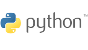

## Python KoolKit



KoolKits (**K**ubernetes t**oolkits**) are language-specific container images, that contain a (highly-opinionated) set of tools for debugging applications running in Kubernetes pods. You can read more about KoolKits [here](../README.md) or learn about the motivation behind this project [here](#Motivation).

Using the Python KoolKit you can spin up a `IPython` or a memory profiler your Kubernetes pods without any configuration or extra setup.

To get started, first add the shorthand `kk` command to your shell by pasting the following snippet into your shell:

```bash
echo "## KoolKits - Shorthand
kk() {
	kubectl debug -it $1 --image=lightruncom/koolkits:$2 --image-pull-policy=Never --target=$3
}" >> ~/.bashrc
source ~/.bashrc
```

Then run the python KoolKit with your pod:

```bash
kk <POD-NAME> python <DEPLOYMENT-NAME>
```

The Python KoolKit contains the following Python utilities (available on `$PATH` wherever applicable):

* [`pyenv`](https://github.com/pyenv/pyenv) - A Python version manager with [Python 3.10.2](https://www.python.org/downloads/release/python-3102/) installed as the default Python version.
* [`ipdb`](https://github.com/gotcha/ipdb) - An interactive debugger with `pdb`'s functionality and `ipython` support.
* [`ipython`](https://ipython.org/) - A powerful, interactive Python command shell.
* [`line_profiler`](https://github.com/pyutils/line_profiler) - Line-by-line profiling for Python.
* [`lptrace`](https://github.com/khamidou/lptrace) - Trace any Python program, anywhere!
* [`memory_profiler`](https://github.com/pythonprofilers/memory_profiler) - Monitor Memory usage of Python code.
* [`pdbpp`](https://github.com/pdbpp/pdbpp) - A drop-in replacement for `pdb`.
* [`pudb`](https://github.com/inducer/pudb)  - A full-screen console debugger for Python.
* [`pyinstrument`](https://github.com/joerick/pyinstrument) - Call stack profiler for Python.
* [`scalene`](https://github.com/plasma-umass/scalene) - A high-performance, high-precision CPU, GPU, and memory profiler for Python.
* [`vprof`](https://github.com/nvdv/vprof) - A visual profiler for Python.
* [`py-heat-magic`](https://github.com/csurfer/pyheatmagic) - IPython magic command to profile and view your python code as a heat map.
* [`py-spy`](https://github.com/benfred/py-spy) - A sampling profiler for Python programs.

In addition, it contains the following  utilities on top of the official [`ubuntu:20.04` image](https://hub.docker.com/layers/ubuntu/library/ubuntu/20.04/images/sha256-7c9c7fed23def3653a0da5bc9ecb651efe155ebd5802c7ba5d585edaa6c89496?context=explore):

```text
bird
build-essential
ca-certificates
calicoctl
conntrack
ctop
curl
dhcping
dnsutils
fping
gdb
git
htop
httpie
iftop
iperf
iproute2
ipset
iptraf-ng
iputils-ping
ipvsadm
jq
ldnsutils
libbz2-dev
libedit-dev
libffi-dev
liblzma-dev
libncursesw5-dev
liboping-dev
libreadline-dev
libsqlite3-dev
libssl-dev
libxml2-dev
libxmlsec1-dev
linux-tools-common
llvm
mongo
mtr
mycli
mysql-client
netcat
netgen
nftables
ngrep
nmap
pgcli
postgresql-client
redis-tools
scapy
socat
software-properties-common
strace
tcpdump
tcptraceroute
termshark
tk-dev
tmux
tshark
unzip
vim
websocat
wget
wuzz
xz-utils
zip
zlib1g-dev
```